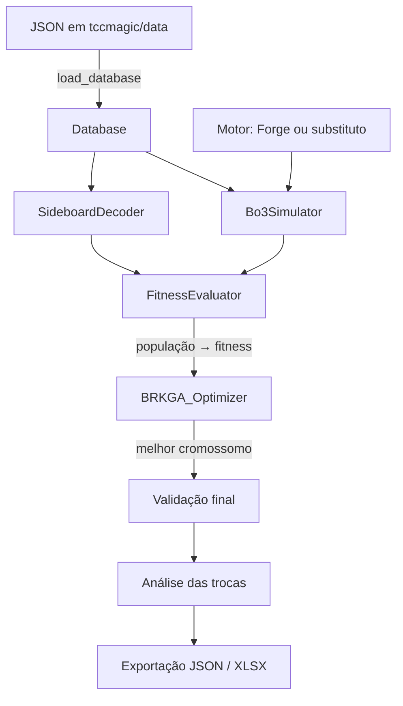

# 01 · Visão geral

## Problema

Em torneios de Magic no formato Modern, cada jogador tem um **maindeck** de 60 cartas e um
**sideboard** de 15. Uma partida é uma série Melhor de 3:

1. o **Game 1** é jogado com o maindeck;
2. entre os jogos, o jogador pode trocar cartas do maindeck por cartas do sideboard;
3. os **Games 2 e 3** são jogados com o deck modificado.

O projeto responde à pergunta: **dado um maindeck fixo e um conjunto de cartas candidatas, quais
15 cartas formam o melhor sideboard contra o metajogo esperado?**

## Ideia central: BRKGA-A

Em vez de escolher IDs de cartas, o cromossomo tem **9 genes, um por atributo** de carta
(remoção, anti-aggro, anti-combo...). Cada gene vira um peso em [−10, +10], cada carta candidata
recebe um *Score* (soma ponderada dos seus atributos) e as 15 entradas de maior Score formam o
sideboard. O algoritmo aprende **quanto vale cada tipo de efeito**, e não quais cartas usar.

Vantagens:

- o cromossomo tem tamanho fixo (9), independente do tamanho do pool de cartas;
- todo cromossomo decodifica para um sideboard legal (15 cartas, regra de 4 cópias);
- os pesos finais são interpretáveis ("o sideboard ideal valoriza remoção e penaliza anti-combo").

## Fluxo do pipeline

Passo a passo de `run_experiment` (`tccmagic/pipeline.py`):

1. Carrega maindeck, pool de sideboard, oponentes e tabela de afinidades.
2. Joga uma única vez os **Games 1** (maindeck vs. cada oponente).
3. Roda o BRKGA. Para cada cromossomo: decodifica o sideboard, monta o plano de troca de cada série,
   joga os Games 2/3 (reaproveitando jogos já simulados) e calcula a taxa de vitória Bo3 ponderada
   pelo metajogo.
4. **Validação:** o melhor sideboard e a linha de base sem sideboard jogam séries novas.
5. **Análise das trocas** (plano aleatório): estima o efeito de cada carta que entrou ou saiu.
6. Exporta histórico, pesos, sideboard, validação e análise para `.json` e `.xlsx`.

## Mapa dos módulos

| Módulo | Papel | Documento |
|---|---|---|
| `tccmagic/attributes.py` | Os 9 atributos e a montagem do vetor v(c) | [04](04-atributos-e-decodificacao.md) |
| `tccmagic/cards.py` | `Card`, `Deck`, `Opponent`, `Database`, carregamento e validação dos JSON | [03](03-dados-de-entrada.md) |
| `tccmagic/decoder.py` | Chaves → pesos → Score → Top-15 | [04](04-atributos-e-decodificacao.md) |
| `tccmagic/brkga.py` | `BRKGA_Optimizer` genérico (não sabe nada de Magic) | [05](05-brkga.md) |
| `tccmagic/sideboarding.py` | Planos de troca: aleatório e por afinidade | [07](07-planos-de-sideboarding.md) |
| `tccmagic/simulation/base.py` | Interface `MatchEngine`, `GameSpec`, `stable_id` | [08](08-motores.md) |
| `tccmagic/simulation/bo3.py` | `Bo3Simulator`: séries, planos por série, cache de jogos, relatórios | [06](06-simulacao-bo3.md) |
| `tccmagic/simulation/surrogate.py` | `SurrogateEngine`: modelo logístico de vitória | [08](08-motores.md) |
| `tccmagic/simulation/forge.py` | `ForgeEngine`: chama o MTG Forge via `subprocess` | [08](08-motores.md) |
| `tccmagic/fitness.py` | `FitnessEvaluator`: cache de sideboards, reamostragem, processos | [09](09-fitness-reamostragem-paralelismo.md) |
| `tccmagic/analysis.py` | Regressão do efeito de cada carta trocada | [10](10-validacao-e-analise-de-trocas.md) |
| `tccmagic/pipeline.py` | `ExperimentConfig`, `run_experiment`, `Validation` | [02](02-instalacao-e-execucao.md), [10](10-validacao-e-analise-de-trocas.md) |
| `tccmagic/export.py` | `export_json`, `export_xlsx` | [11](11-saidas-json-xlsx.md) |
| `main.py` | CLI, menu interativo e impressão do relatório | [02](02-instalacao-e-execucao.md) |
| `tests/` | Testes automatizados (pytest) | [13](13-testes.md) |

## Princípios de projeto

- **Separação de responsabilidades:** o BRKGA só conhece vetores e uma função de fitness, e toda
  a semântica de Magic fica no decodificador e no simulador.
- **Estruturas imutáveis** (`@dataclass(frozen=True)`): podem ser enviadas a processos filhos e
  usadas como chave de cache.
- **Reprodutibilidade:** sementes fixas para o BRKGA (`seed`), o simulador substituto (`sim_seed`)
  e os sorteios de troca (`plan_seed`). O hash usado nos sorteios (`blake2b`) é estável entre
  processos e execuções, ao contrário do `hash()` do Python.
- **Honestidade estatística:** o fitness da busca é otimista por construção (é o máximo de muitas
  estimativas ruidosas). Por isso os números finais vêm de uma validação com séries novas e de uma
  comparação com a linha de base sem sideboard.

## Glossário

| Termo | Significado |
|---|---|
| Maindeck | Deck principal de 60 cartas, fixo durante a otimização |
| Sideboard | As 15 cartas que podem entrar nos Games 2/3 |
| Pool | Cartas candidatas a compor o sideboard (`sideboard_pool.json`) |
| Slot / entrada | Uma cópia específica de uma carta do pool ("Blood Moon #2") |
| Flex | Carta do maindeck que pode sair no sideboarding (`"flex": true`). Terrenos nunca são flex |
| Plano de troca | O que entra e o que sai entre o Game 1 e os Games 2/3 |
| Md1 | Game 1 (pré-sideboard) |
| Bo3 | Série Melhor de 3 |
| ΔWinRate | WinRate_Bo3 − WinRate_Md1 |
| Linha de base | Bo3 sem sideboard: Games 2/3 jogados com o maindeck |
| Metajogo | Conjunto de oponentes, cada um com uma participação (`meta_share`) |
| Motor | Quem decide o vencedor de cada jogo: `ForgeEngine` ou `SurrogateEngine` |
| CRN | *Common random numbers*: a mesma "sorte" para candidatos diferentes, reduzindo variância |
