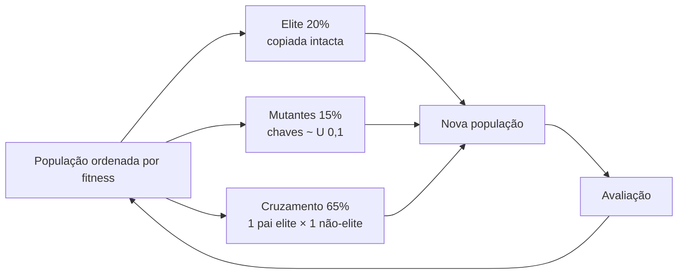

# 05 · BRKGA

Módulo: `tccmagic/brkga.py`. Referência: Gonçalves & Resende (2011), *Biased random-key genetic
algorithms for combinatorial optimization*.

O otimizador é **genérico**. Ele só conhece vetores de chaves em [0, 1)ⁿ e uma função que devolve o
fitness (a maximizar) de uma população inteira. Neste projeto, n = 9 (um gene por atributo).

## Configuração: `BRKGAConfig`

| Campo | Padrão | Significado |
|---|---|---|
| `population_size` | 50 | Indivíduos por geração (mínimo 3) |
| `elite_fraction` | 0,20 | Fração copiada sem alteração |
| `mutant_fraction` | 0,15 | Fração de indivíduos novos aleatórios |
| `elite_bias` (ρ) | 0,70 | Probabilidade de herdar cada gene do pai elite. Deve estar em [0,5; 1] |
| `generations` | 50 | Gerações após a inicial |
| `max_stall_generations` | `None` | Parada antecipada |
| `seed` | 42 | Semente do gerador |

Tamanhos derivados:

- `n_elite = max(1, round(elite_fraction · P))`;
- `n_mutants = round(mutant_fraction · P)`;
- `n_offspring = P − n_elite − n_mutants`.

Com P = 16: 3 elites, 2 mutantes e 11 filhos. Com P = 100: 20, 15 e 65.

## Ciclo de uma geração

**Cruzamento uniforme parametrizado:** para cada filho, sorteia-se um pai elite e um pai não-elite,
e cada gene vem do pai elite com probabilidade ρ = 0,70.

## Fitness determinístico vs. ruidoso

| | Determinístico (substituto) | Ruidoso (Forge) |
|---|---|---|
| Parâmetro | `reevaluate_elites=False` | `reevaluate_elites=True` |
| Elites | Mantêm o fitness já calculado | Toda a população é reavaliada a cada geração |
| Melhor fitness | Nunca piora (elitismo) | Pode cair de uma geração para a outra |
| "Melhora" (parada antecipada) | Fitness estritamente maior | Troca de líder |
| Ao final | — | `refresh_elites()`: rodada extra só da elite antes de escolher o melhor |

O pipeline liga `reevaluate_elites` sempre que a reamostragem está ativa (padrão no Forge). Com
reamostragem, cada reavaliação de um sideboard joga mais séries e soma às anteriores
([09](09-fitness-reamostragem-paralelismo.md)). Assim, um sideboard que teve sorte uma vez regride à
sua taxa real em vez de ficar na elite para sempre.

`refresh_elites()` existe porque, logo depois de `step()`, o líder pode ser um recém-chegado
avaliado uma única vez. A rodada extra garante que o melhor final foi confirmado ao menos uma vez.

## Parada antecipada

Com `max_stall_generations = N`, a execução para depois de N gerações seguidas sem melhora, e
`BRKGAResult.stopped_early` vira `True`.

## Saídas

- `GenerationStats` (uma por geração): `generation`, `best_fitness`, `mean_fitness`,
  `std_fitness`, `best_keys`, `elapsed_seconds`. É passada ao callback `on_generation`.
- `BRKGAResult`: `best_keys`, `best_fitness`, `history`, `stopped_early`.

## Observação sobre ruído

Com o Forge, o erro padrão do fitness de uma rodada é de até `0,5 · sqrt(Σ share² / n)`: cerca de
±0,04 com 30 séries por oponente e cinco oponentes de peso parecido. Diferenças reais menores que
isso entre sideboards ficam escondidas. No experimento de 8 gerações
([14](14-experimentos-e-limitacoes.md)), a distância entre o melhor e a média da população foi
compatível com puro ruído.
