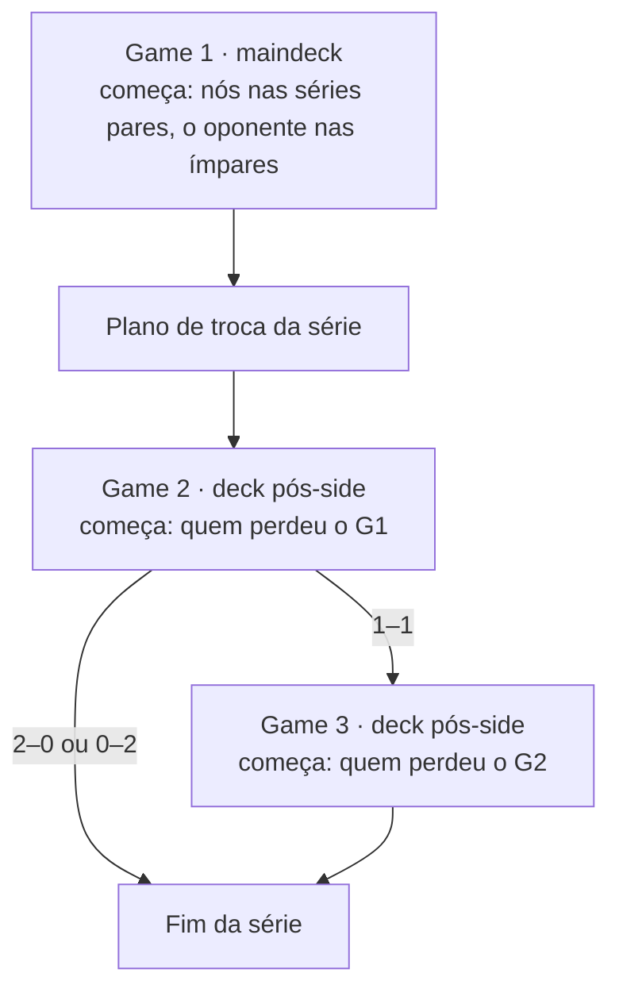

# 06 · Simulação Bo3

Módulo: `tccmagic/simulation/bo3.py`, classe `Bo3Simulator`.

## Estrutura de uma série



- **Game 1:** sempre com o maindeck, então é **jogado uma única vez** (`prepare`) e reaproveitado
  por todos os indivíduos e rodadas. Quem começa alterna entre as séries, o que dá equilíbrio
  exato de play/draw.
- **Games 2/3:** jogados com o deck do plano de troca daquela série
  ([07](07-planos-de-sideboarding.md)). O Game 3 só acontece se a série estiver 1–1.
- O motor Forge ignora quem começa ([08](08-motores.md)). O substituto usa essa informação.

## Plano por série

`plan_for(opp, sideboard, match_index)` devolve o `SideboardPlan` da série:

- **`afinidade`:** um plano por (oponente, sideboard), igual em todas as séries;
- **`aleatorio`:** um plano por (oponente, sideboard, bloco), com
  `bloco = match_index // plan_block`.

Os planos ficam em memória (`_plans`), então cada combinação é calculada uma única vez.

## Cache de jogos

O resultado de um jogo depende só do **deck pós-side**, do oponente e da série, e não do sideboard
de 15 cartas que originou o deck. Por isso cada jogo pós-side simulado fica em `Bo3Simulator.games`,
com a chave

```
GameKey = (oponente, assinatura do deck, índice da série, nº do jogo, começa jogando)
```

A **assinatura do deck** é `SideboardPlan.signature`: a tupla ordenada dos nomes que entram e a tupla
ordenada dos nomes que saem. Como o maindeck é fixo, ela identifica o deck.

Consequências:

- dois sideboards diferentes que levam ao mesmo deck contra um oponente compartilham os jogos;
- dentro de uma geração, um deck repetido é simulado uma única vez;
- reavaliar as mesmas séries (mesmo índice) não joga nada de novo.

Contadores: `games_played` (jogos que o motor simulou) e `games_reused` (jogos atendidos pelo
cache). Ambos aparecem por geração e no resumo.

> Com o Forge (não determinístico), reaproveitar um jogo para outro sideboard que gerou o mesmo
> deck é estatisticamente válido: é uma amostra do mesmo deck contra o mesmo oponente. Isso também
> cria correlação positiva entre as estimativas de sideboards parecidos, o que torna a comparação
> entre eles mais precisa.

## Execução em fases e lotes

`play_postboard(jobs, game1, runner)` recebe vários pares (sideboard, índice inicial das séries) e
processa todos juntos.

1. **Monta as séries** de todos os sideboards × oponentes, cada uma com o seu plano.
2. **Fase G2** (`_play_phase`): para cada jogo, consulta o cache. Os jogos que faltam são agrupados
   em **um lote por (oponente, assinatura do deck)** e entregues ao `runner`.
3. **Fase G3:** o mesmo, só para as séries empatadas em 1–1.
4. **Relatórios:** um `EvaluationReport` por sideboard, com um `MatchupReport` por oponente.

O `runner` é quem executa os lotes. O padrão (`run_batches`) é serial, e o `FitnessEvaluator` passa
um runner paralelo ([09](09-fitness-reamostragem-paralelismo.md)). No Forge, **cada lote é uma
chamada à JVM**, então agrupar por deck minimiza o número de inicializações.

## Relatórios

### `MatchupReport` (um oponente)

| Campo | Significado |
|---|---|
| `opponent`, `archetype`, `meta_share` | Identificação |
| `n_matches` | Séries jogadas |
| `game1_wins` | Vitórias no Game 1 |
| `match_wins` | Séries vencidas (2–0 ou 2–1) |
| `postboard_games`, `postboard_wins` | Jogos 2 e 3 disputados e vencidos |
| `swaps_in`, `swaps_out` | `(carta, cópias)` somadas sobre todas as séries |

| Propriedade | Fórmula |
|---|---|
| `winrate_md1` | `game1_wins / n_matches` |
| `winrate_bo3` | `match_wins / n_matches` |
| `winrate_postboard` | `postboard_wins / postboard_games` |
| `delta_winrate` | `winrate_bo3 − winrate_md1` |
| `cards_in`, `cards_out` | Texto "+2 Wrath of the Skies, ..." com **cópias por série**: inteiras no plano por afinidade, médias no aleatório ("+0.43 Blood Moon") |

`merge(other)` soma as contagens de outra rodada do mesmo confronto. É isso que permite acumular
séries com a reamostragem.

### `EvaluationReport` (todos os oponentes)

As taxas agregadas são **médias ponderadas por `meta_share`**. `n_matches` é o mínimo entre os
oponentes.

`stderr_bo3` é o erro padrão da WinRate_Bo3 agregada, supondo séries independentes:

```
var = Σ_opp (share/Σshare)² · p̃(1 − p̃) / (n + 4),     p̃ = (vitórias + 2) / (n + 4)
```

A proporção ajustada de Agresti–Coull evita erro zero em confrontos com 0% ou 100%.

## Funções auxiliares

- `wilson_interval(wins, n, z=1.96)`: intervalo de Wilson para uma proporção. É usado em
  `--game1-check`.
- `_hash_unit(text)`: número em [0, 1) derivado de `blake2b(text)`, estável entre processos. É a
  fonte dos sorteios do plano aleatório.
