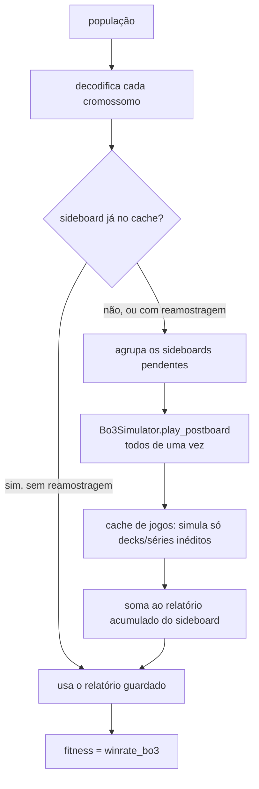

# 09 · Fitness, reamostragem e paralelismo

Módulo: `tccmagic/fitness.py`, classe `FitnessEvaluator`.

## Definição do fitness

```
fitness(x) = Σ_opp share(opp) · WinRate_Bo3(opp) / Σ share
```

O cromossomo `x` é decodificado em um sideboard, o sideboard joga séries Bo3 contra cada oponente,
e a taxa de vitória de séries é ponderada pela participação no metajogo.

Como o Game 1 usa sempre o mesmo maindeck, WinRate_Md1 é **constante entre indivíduos**. Maximizar
WinRate_Bo3 equivale, portanto, a maximizar ΔWinRate = WinRate_Bo3 − WinRate_Md1.

## Da população ao fitness

`FitnessEvaluator` é chamável: `evaluator(population) → array de fitness`, que é a interface
exigida pelo BRKGA.



## Os dois caches

| Cache | Onde | Chave | O que evita |
|---|---|---|---|
| De sideboards | `FitnessEvaluator.cache` | `DecodedSideboard.key` (15 rótulos ordenados) | Reavaliar um Top-15 já visto (quando não há reamostragem) |
| De jogos | `Bo3Simulator.games` | (oponente, deck, série, jogo, quem começa) | Simular de novo um jogo de um deck já jogado naquela série, mesmo vindo de outro sideboard |

O cache de jogos está descrito em [06](06-simulacao-bo3.md#cache-de-jogos). No teste com o
substituto (população 30, 10 gerações), 82% dos jogos pós-side vieram dele.

## Reamostragem

Ativada com `resample=True`, que é o padrão com o Forge. Cada vez que um sideboard é avaliado, ele
joga **mais uma rodada** de `matches_per_opponent` séries, e o resultado é **somado** às rodadas
anteriores (`EvaluationReport.merge`). O fitness é a taxa acumulada.

- A rodada r usa os índices de série `r · n … r · n + n − 1`, ou seja, séries novas.
- Os Games 1 são os mesmos em todas as rodadas (`game1`), e só os Games 2/3 são novos.
- `rounds[key]` conta quantas rodadas cada sideboard já jogou.
- Um sideboard que teve sorte em poucas séries regride à taxa real, em vez de ficar no topo.

`evaluate_one(keys)` consulta um indivíduo **sem** jogar rodadas extras. É usado para registrar o
histórico e o melhor final.

## Paralelismo

Com `workers > 1`, o avaliador cria um `ProcessPoolExecutor`.

- O simulador é enviado a cada processo **uma única vez**, pelo `initializer` (`_init_worker`), e
  não a cada tarefa.
- Há dois tipos de tarefa (`_run_task`):
  - `("game1", i, n, offset)`: Games 1 com o maindeck contra o oponente i;
  - `("games", i, deck, specs)`: um lote de jogos pós-side de um deck contra o oponente i.
- A orquestração (planos, cache, fases G2/G3) roda no processo principal, e só os lotes vão para os
  workers. Por isso o cache de jogos fica centralizado e é consistente.
- `chunksize = max(1, nº de tarefas // (4 · workers))`.

Use o avaliador como gerenciador de contexto (`with FitnessEvaluator(...) as ev:`) para encerrar o
pool ao final.

## Contadores

| Atributo | Significado |
|---|---|
| `FitnessEvaluator.simulations` | Rodadas de sideboard avaliadas (sideboard × rodada) |
| `Bo3Simulator.games_played` | Jogos pós-side efetivamente simulados pelo motor |
| `Bo3Simulator.games_reused` | Jogos pós-side atendidos pelo cache |

## Ruído esperado

O erro padrão do fitness de uma rodada é de até `0,5 · sqrt(Σ (share/Σshare)² / n)`. Com cinco
oponentes de peso parecido, isso dá cerca de `0,22/√n`:

| Séries por oponente (n) | Erro padrão máximo |
|---|---|
| 2 | ±0,16 |
| 30 | ±0,04 |
| 100 | ±0,02 |

`main.py` mostra esse valor (`fitness_noise`) ao iniciar uma execução com o Forge.
